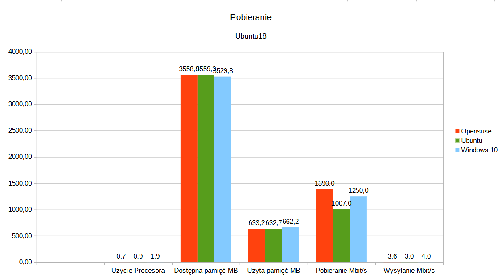
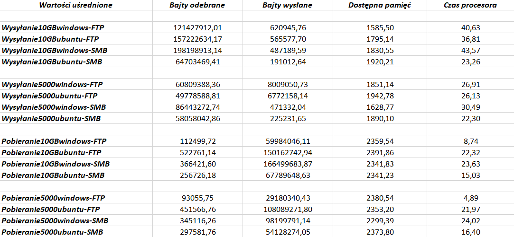

# Systems Performance Benchmarking

An academic case study of file-transfer workloads and system resource monitoring, adapted from two historical reports involving **Kacper Lebida**.

## Studies

| Study | Documented scope | Attribution |
| --- | --- | --- |
| Ubuntu FTP resource monitoring | Ubuntu Server 18/20/22, with Windows 10, Ubuntu and openSUSE clients | Kacper Lebida and Kuba Bąk |
| Windows Server FTP vs SMB | Upload/download of one 10 GB file and a folder of 5,000 files, with Windows 10 and Ubuntu 18.04 clients | Source signed by Kacper Lebida |

## Tools and environment

The FTP monitoring document references `vsftpd`, `nmon`, `vnstat`, Netplan and Windows Performance Monitor. It describes a host with an Intel i5-11600 and 16 GB RAM. Server VMs receive four virtual processors and 4 GB RAM; client VMs receive two virtual processors and 2 GB RAM, except Windows with 4 GB RAM.

## Methodology review

The reports compare resource use during transfers. A selected Ubuntu chart and the Windows FTP/SMB summary table have been extracted and reviewed. They are included unchanged below; no new benchmark measurements were generated.

The original FTP report explicitly notes that at least one observation comes from a single test. Different RAM allocations and operating systems also limit direct comparison. Historical conclusions should therefore be framed as observations from that setup, not general claims about which operating system or protocol is faster.

## Reproducible next iteration

For a repeatable benchmark, record the host, hypervisor, VM allocations, storage, virtual network mode, client/server versions, transfer tool, payload, caching conditions and sampling interval. Use repeated runs, keep raw measurements and report variation as well as averages.

The original monitoring command needs checking before reuse; the text alone is not enough to validate its sampling configuration. The located analysis spreadsheet is the next source to inspect for raw data.

## Portfolio status

This package is a reviewed summary of the source text. It is not a newly executed benchmark. There are no fabricated throughput, CPU or memory measurements. The next step is to recover raw logs and sampling definitions before attempting statistical comparisons or a new benchmark.

## Original result artifacts

This chart comes from the Ubuntu FTP monitoring report credited to Kacper Lebida and Kuba Bąk. It groups CPU use, memory in MB, and transfer rates labeled Mbit/s on one shared axis. Those quantities have different units and must not be compared by bar height across categories. The underlying sampling, aggregation and virtual-network constraints need verification before treating these as throughput measurements.

This table comes from my Windows Server FTP/SMB report. It contains upload/download scenarios for a 10 GB file and 5,000 files, using Windows and Ubuntu clients. Its columns are received bytes, sent bytes, available memory and processor time, but the image alone does not specify counter definitions or sampling units. It therefore does not justify a reliable FTP-versus-SMB speed ranking.

Both artifacts are preserved unchanged from the original documents. This review adds interpretation and limitations; it does not recalculate unavailable raw data. Prepared with Codex assistance on 13 September 2026.
